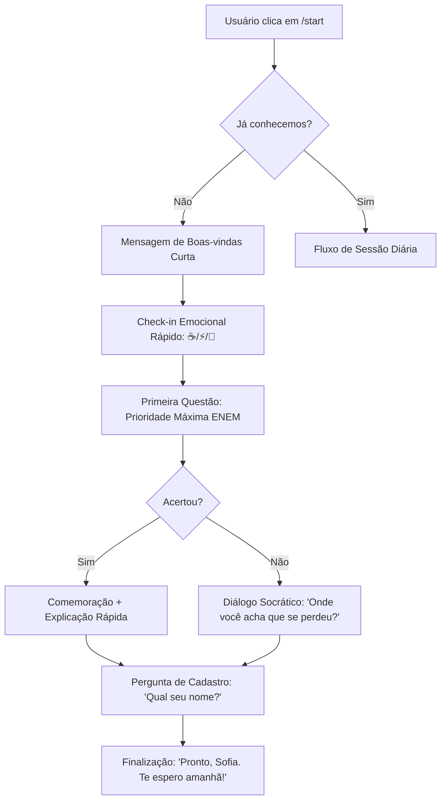

# Fluxo de Onboarding: Tutora ENEM

O objetivo é que o usuário responda à primeira questão em **menos de 30 segundos** após o primeiro clique.

## 1. Mapeamento do Fluxo

---

## 2. Detalhamento das Etapas

### Passo 1: O Gatilho (/start)
A mensagem inicial deve ser acolhedora e focar na dor da Sofia (ansiedade/tempo).
*   **Exemplo:** *"Oi! Eu sou a Tutora ENEM. Vou te ajudar a estudar 15 minutinhos por dia, sem pirar. Vamos testar um desafio agora?"*

### Passo 2: O Check-in Emocional (A 1ª Decisão)
Não perguntamos "quem é você", perguntamos "como você está".
*   **Opções:**
    *   ☕️ **Calma:** Sessão padrão.
    *   ⚡️ **Pilhadona:** Questão de desafio (mais difícil).
    *   🔋 **No Limite:** Questão de revisão rápida ou dica motivacional.

### Passo 3: A 1ª Questão (A Entrega de Valor)
O bot envia uma questão real do ENEM, formatada para mobile (texto curto ou imagem legível).
*   **Importante:** A questão deve ser de um tópico "quente" (ex: Grandezas Proporcionais ou Interpretação de Texto), para que ela sinta que o bot sabe o que cai na prova.

### Passo 4: A Captura de Dados "In-Flow"
Só pedimos o nome e o objetivo (ex: curso desejado) **após** ela ter interagido com a questão. Isso aumenta a taxa de conversão pois ela já experimentou o produto.
*   **Bot:** *"Aliás, como posso te chamar? Quero salvar seu progresso aqui!"*

---

## 3. Estratégias de Retenção Pós-Onboarding

1.  **Lembrete Inteligente:** Se ela parou no meio da questão, o bot manda um "Pai tá on? 🫡 Brincadeira, a Tutora tá on. Vamos terminar aquela questão?".
2.  **Gancho para Amanhã:** "Por hoje é só. Amanhã tenho uma de Biologia que caiu em 2023 e 80% da galera errou. Quer que eu te avise?".

---

## 4. Requisitos Técnicos para o Onboarding

*   **Persistência:** Salvar o `chat_id` e o estado da conversa (`onboarding_step`) no banco.
*   **Análise de Erro:** O sistema de IA já deve estar ativo no Passo 3 para analisar se o erro foi por "falta de base" ou "desatenção".
